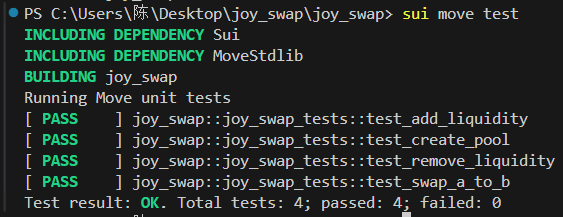

# `joy_swap` Module

The `joy_swap` module provides a decentralized finance (DeFi) application where users can create liquidity pools, add liquidity, remove liquidity, and swap tokens. This module supports operations involving two different types of tokens, `Coin_A` and `Coin_B`, in a liquidity pool.

## Structs

### 1. **LP<phantom Coin_A, phantom Coin_B>**
+ This struct represents a liquidity pool's LP (Liquidity Provider) token. 
+ It is a phantom struct that pairs two types of coins (`Coin_A` and `Coin_B`) together to create an LP token for the pool.

### 2. **Pool<phantom Coin_A, phantom Coin_B>**
+ This struct represents a liquidity pool containing two types of tokens (`Coin_A` and `Coin_B`). 
+ It holds the balances of each token and tracks the LP token supply for the pool.
---

## Functions

### 1. **Create Pool**
   - **Description**: Users can create a new liquidity pool containing two different tokens: `Coin_A` and `Coin_B`. When creating the pool, the user must provide an amount of `Coin_A` and `Coin_B`.
   - **How it Works**:
     1. The user calls the `create_pool<Coin_A, Coin_B>` function with the two tokens `Coin_A` and `Coin_B`.
     2. The function verifies that both tokens have non-zero values.
     3. The values of the tokens are converted into `Balance` types, and the number of liquidity pool (LP) tokens to mint is calculated based on the square root of the product of the two token values.
     4. The pool is created and the LP tokens are issued to the user.
   
   - **Related Event**:
     - `PoolCreated`: Emits an event containing the pool's ID, token types, initial token values, and minted LP tokens.

### 2. **Add Liquidity**
   - **Description**: Users can add liquidity to an existing liquidity pool. The user provides additional amounts of `Coin_A` and `Coin_B`. If the amounts do not match the existing pool ratios, excess tokens are refunded to the user.
   - **How it Works**:
     1. The user calls the `add_liquidity<Coin_A, Coin_B>` function, passing the liquidity pool and the tokens to add.
     2. The function verifies that both tokens have non-zero values and calculates the current ratios of the pool's tokens.
     3. If the provided tokens do not match the pool's ratio, the excess tokens are refunded.
     4. The LP token supply is adjusted based on the new liquidity added.
     5. The newly minted LP tokens are issued to the user.
   
   - **Related Event**:
     - `LiquidityAdded`: Emits an event containing the pool's ID, token types, added token values, and minted LP tokens.

### 3. **Remove Liquidity**
   - **Description**: Users can remove liquidity from an existing liquidity pool by providing LP tokens. The system calculates the amounts of `Coin_A` and `Coin_B` to be refunded based on the LP token value and the pool's ratio.
   - **How it Works**:
     1. The user calls the `remove_liquidity<Coin_A, Coin_B>` function with the LP token to burn.
     2. The function verifies that the LP token has a non-zero value.
     3. The liquidity to be removed is calculated based on the LP token value and the pool's token ratios.
     4. The LP tokens are burned, and the corresponding amounts of `Coin_A` and `Coin_B` are returned to the user.
   
   - **Related Event**:
     - `LiquidityRemoved`: Emits an event containing the pool's ID, token types, removed token values, and burned LP tokens.

### 4. **Swap Tokens A to B**
   - **Description**: This function allows users to swap `Coin_A` for `Coin_B`. The swap follows the constant product formula: `k = balance_a * balance_b`. Fees are deducted from the output token.
   - **How it Works**:
     1. The user calls the `swap_a_to_b<COin_A, Coin_B>` function with `Coin_A` to swap.
     2. The function calculates the new balance after the swap and ensures that the new token value is within the expected range.
     3. A small fee (0.3%) is deducted from the output token (`Coin_B`).
     4. The swapped tokens are transferred to the user.
   
   - **Related Event**:
     - `Swaped`: Emits an event containing the pool's ID, the input token, input value, output token, and output value.

### 5. **Swap Tokens B to A(same as above)**
---

## Test
